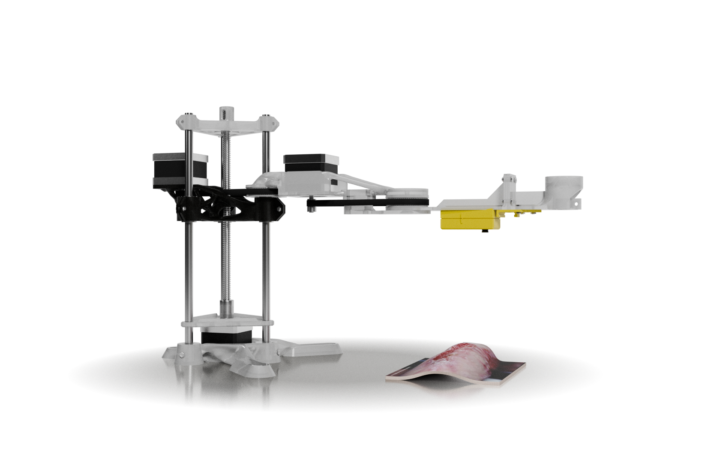
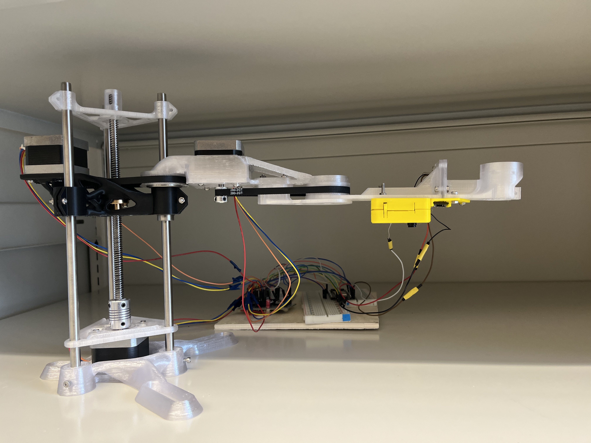

# BME498_bioprinter

An automatic scanning SCARA robotic arm bioprinter prototype. The bioprinter can:
- Capture a image of it's print area.
- Identify and segment areas to be printed in the captured image.
  - manual selection of print area is also possible.
- Scan the topology of the area.
  - The resolution of the depth map can be adjusted.
- Print while compensating for the depth of the scanned area.

Features:
- IK calculation in python.
- Stepper motor quantize error compensation.
- Image segmentation with SAM2.
- ToF sensor and camera module.
- Manual motor and position control.
- Built with 3D printed parts for <200 CAD.
- Large reach with 2x 15 cm arms.
- Extendable Z axis.
- Modular arm design with expansion screw slots.
- Only simple "from built plate" supports required for 3D printing, most part require no supports.
- Adjustable error compensation for camera and ToF sensor.

## Testing bioprinter setup
1. Connect the esp32 to your laptop via an usb cable.
2. Connect the esp32 CAM to your laptop via an usb cable.
3. Follow the instruction in Bioprinter user manual.pdf

